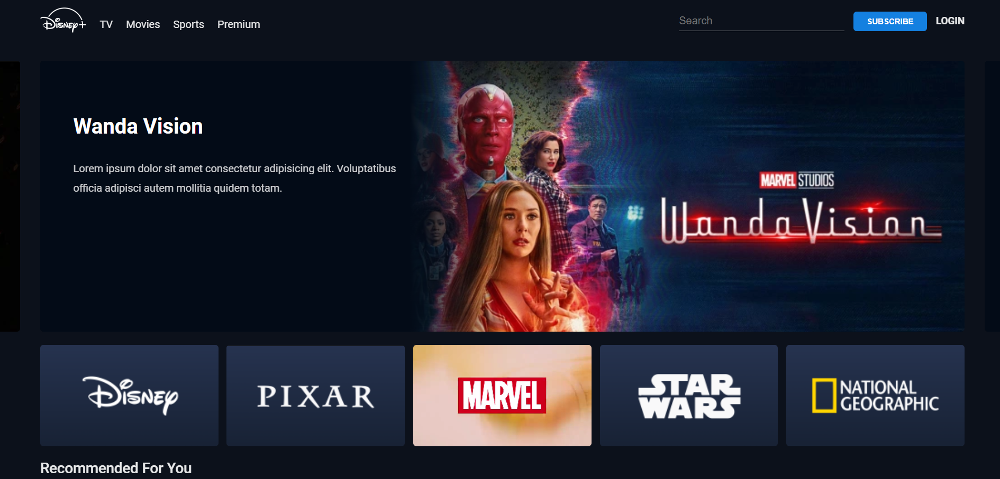

# Hotstar Landing Page Clone

This project is a clone of the Hotstar landing page, built using HTML, CSS, and JavaScript. It was developed by following a 7-day YouTube bootcamp tutorial by DevTown.

## Features

- Responsive design: The landing page is designed to adapt to different screen sizes and devices, providing a seamless user experience.
- Navigation menu: The navigation menu consists of different menu options, a search bar, login and subscription buttons.
- Image carousel: A carousel of Image is displayed, showcasing popular content on Hotstar.
- Content categories: Various content categories, such as Popular Shows, Recommended For You are showcased with appealing images and descriptions.

## How to Run

1. Clone the repository: `https://github.com/Aafil-Shaikh/Hotstar-Clone.git`
2. Navigate to the project directory: `cd Hotstar-Clone`
3. Open the `index.html` file in your preferred web browser.

## Contributing

Contributions are welcome! If you find any issues or want to enhance the project, feel free to submit a pull request. Please make sure to follow the project's code of conduct.

## Credits

- The tutorial for this project was created by DevTown. You can find the original tutorial on their YouTube channel: [DevTown](https://www.youtube.com/@DevTownIndia).
- The Hotstar logo and images used in this project are the property of their respective owners and are used for educational purposes only.

## License

This project is licensed under the [MIT License](LICENSE). Feel free to use, modify, and distribute the code for personal or commercial purposes.
